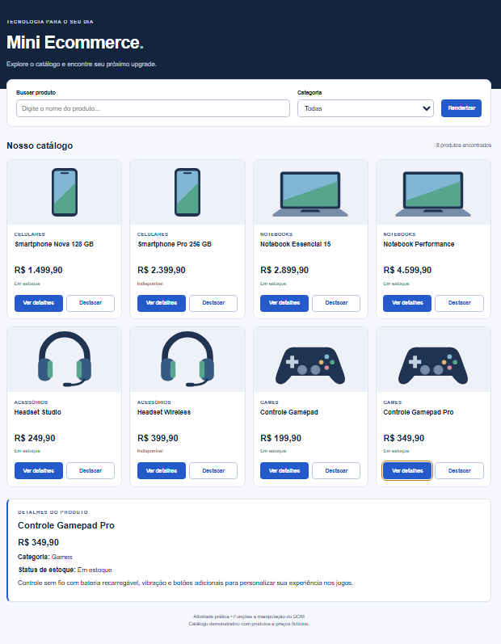
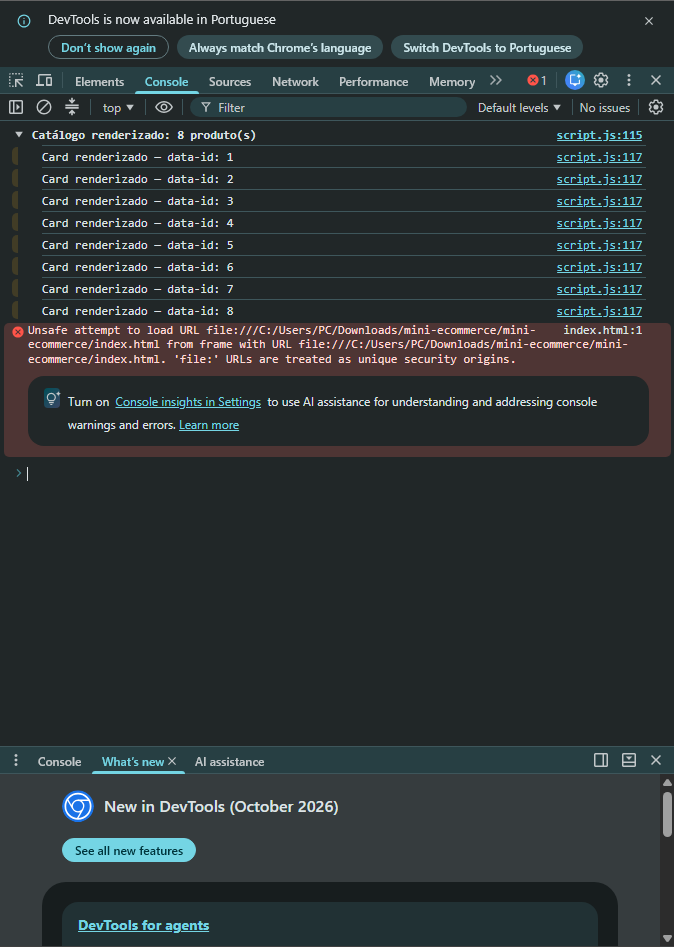

# Mini Ecommerce — Funções e manipulação do DOM

Atividade prática da Semana 9.

- **Nome:** Bernardo Almeida Andrade
- **Matrícula:** 931797

## Como executar

Abra a pasta no Visual Studio Code e abra `index.html` em um navegador. Se preferir, use a extensão Live Server. Não é necessário instalar dependências ou executar comandos npm. As imagens são ilustrações SVG locais e funcionam sem internet.

## Funcionalidades

- Oito produtos organizados em Celulares, Notebooks, Acessórios e Games.
- Busca por nome, sem diferenciar maiúsculas, minúsculas ou acentos.
- Filtro por categoria combinado com a busca.
- Botão Renderizar que recria o catálogo respeitando os filtros atuais.
- Botão Ver detalhes que preenche o box abaixo do catálogo com nome, preço, categoria, estoque e descrição.
- Botão Destacar que adiciona ou remove o destaque visual do card.
- Mensagem quando não há resultados e contador de produtos encontrados.
- Layout responsivo e saída no console com o `data-id` de cada card renderizado.

Os produtos, preços e especificações são fictícios e têm finalidade didática.

## Estrutura

- `index.html`: estrutura da página e controles.
- `styles.css`: layout, cores e classe de destaque.
- `script.js`: dados, funções, criação dos cards e eventos.
- `imagens/`: ilustrações locais dos produtos.
- `prints/`: pasta destinada às capturas solicitadas na atividade.

## Funções e métodos utilizados

| Função | Responsabilidade |
| --- | --- |
| `formatPrice(preco)` | Formatar o preço em reais. |
| `createProductCard(produto)` | Criar um card e registrar seus eventos. |
| `renderProducts(produtos)` | Limpar a lista e inserir os cards. |
| `renderCategories()` | Preencher as categorias com base nos produtos. |
| `showProductDetails(produto)` | Preencher o box de detalhes. |
| `filterProducts()` | Retornar os produtos que correspondem à busca e à categoria. |
| `normalizeText(texto)` | Normalizar o texto da busca. |
| `updateCatalog()` | Aplicar os filtros e renderizar o resultado. |

O código utiliza `getElementById`, `querySelector`, `querySelectorAll`, `innerHTML`, `createElement`, `setAttribute`, `appendChild`, `classList.add`, `style` e `addEventListener`. Após renderizar, `querySelectorAll(".card")` percorre os cards e imprime seus identificadores no console.

## Prints da atividade — adicionar antes da entrega

### Catálogo e detalhes

Abra a página, clique em **Ver detalhes** e tire um print mostrando os cards e a área de detalhes preenchida. Se necessário, diminua o zoom do navegador. Salve a imagem como `prints/catalogo.png`.

Depois de salvar, substitua esta instrução pela linha:

```markdown

```

### Console do navegador

Pressione **F12**, abra a aba **Console** e clique em **Renderizar** com a busca vazia e a categoria Todas. Expanda o grupo “Catálogo renderizado” caso esteja recolhido e capture a saída dos oito identificadores. Salve como `prints/console.png`.

Depois de salvar, substitua esta instrução pela linha:

```markdown

```

## Checklist de entrega

- [ ] Preencher a matrícula neste README.
- [ ] Adicionar os dois prints reais conforme as instruções acima.
- [ ] Criar e usar o branch `bernardo`.
- [ ] Conferir as interações no navegador.
- [ ] Fazer o commit e o push do branch.
- [ ] Enviar a URL do repositório no Canvas.

Mensagem de commit solicitada (substitua XXXXXXX pela matrícula):

```text
Atividade Prática - Funções e DOM - matrícula: XXXXXXX
```
